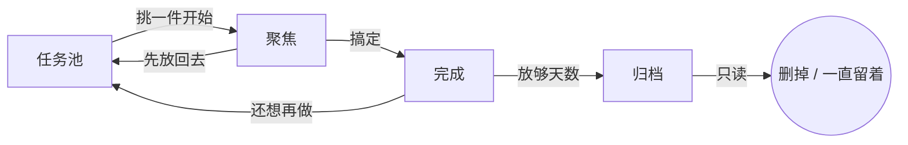

<p align="center">
  
</p>

<h1 align="center">随随办办 / FlowDo</h1>

<p align="center">
  不设截止日期。想到就丢进任务池，一次只盯手头这几件。<br>
  随随办办，总会办完。Go with the flow, get it done.
</p>

<p align="center">
  <a href="https://github.com/ShuangqiLi/FlowDo/releases"></a>
  <a href="LICENSE"></a>
  
  
</p>

服务端和客户端都由你自己部署，任务存在你自己的 PostgreSQL 里。没有官方托管，没有在线 Demo，
发版包解压就能跑。

## 它是怎么运转的

任务只有四个位置，一件事从进来到消失就走这一条路：



| 位置 | 你在这里做什么 |
|---|---|
| **任务池** | 想到就写一行，或按住麦克风说一句。默认中优先级，先收下来再说 |
| **聚焦** | 从任务池挑几件真要动手的。有数量上限（默认 3 件），满了得先交差 |
| **完成** | 搞定的事。留几天回头能看见，然后自动进归档 |
| **归档** | 只读的旧账。可以手动删，也可以设成永久保留 |

没有截止日期，没有倒计时压力。整体借鉴了 GTD 的「先收集、再理清、只做手头这几件」，
但刻意做得更轻：不分情境标签，不建项目树，也不要求你每周坐下来做一次完整回顾。

## 一天里怎么用

**想到就收。** 任务池顶上是一行输入框，敲完回车就进来了。不方便打字就按住麦克风说，
用的是系统自带的语音识别，松开即成文，结尾的句号会自动去掉。新任务一律中优先级，
不在收集这一步逼你做判断。

**回头再理清。** 点开任务卡可以补几句随手记；点一下优先级徽章，就地弹出高 / 中 / 低的小菜单。

**只盯手头这几件。** 把任务从任务池放进聚焦。聚焦有上限，默认 3 件，满了想再加，
得先搞定一件或者放回去。桌面和网页上用按钮操作，手机和平板上左右滑动，避免误触。

**每天看一眼。** 当天第一次打开会弹出「今日看看」：先列正在聚焦的，如果手头空着，
就从任务池挑几件高优先级的推荐给你。看完划走，标题栏的太阳图标随时能再叫出来。

**完成之后自己收拾。** 完成的任务放够天数（默认 7 天）自动进归档；归档再放够天数
（默认 30 天）自动清掉。想留着就把清理天数填 `0`，归档里会显示「永久保留」，
定时任务不会碰它。

其他：注册登录的多用户隔离（JWT），薄荷绿 / 雾霾蓝 / 暖橘色 / 淡紫色四套主题跟着账号走，
界面组件整理成了可复用的 [FlowDo UI Kit](docs/UI_KIT.md)。

## 技术架构

| 部分 | 用了什么 |
|---|---|
| 客户端 | Flutter 一套代码，出 Web / Windows / Android / iOS 包 |
| 服务端 | NestJS + Prisma + PostgreSQL，JWT 鉴权，按账号隔离数据 |
| 编排 | 仓库根目录一份 `docker-compose.yml`，靠环境变量和 profile 区分场景 |
| 公网 | Caddy 反代，自动申请证书，只对外开 80 / 443 |

API 默认只绑在 `127.0.0.1:3000`，数据库只绑 `127.0.0.1:5432`，都不对公网开放。
公网访问一律走域名 + HTTPS。

状态流转的硬规则：待办 ↔ 聚焦，聚焦 → 完成，完成 → 待办 / 归档；归档只读，
不能改状态，只能删除。

## 快速上手

### 1. 起服务端

从 [Releases](https://github.com/ShuangqiLi/FlowDo/releases) 下载 `FlowDo-server-docker-*.zip`，
解压到装了 Docker 的机器上。包里有服务端镜像、PostgreSQL 和 Caddy，不需要 Node.js。

```bash
chmod +x start.sh && ./start.sh    # Windows 用 start.ps1
```

不填域名就是本机自用，健康检查 `http://127.0.0.1:3000/health`。

要给外网用，先把域名的 A 记录指到这台机器、安全组放行 80 和 443，
然后在脚本生成的 `.env` 里填好域名，再跑一次启动脚本：

```
DOMAIN=api.example.com
```

就绪后 API 是 `https://api.example.com`，走 HTTPS，证书自动申请续期。

### 2. 装客户端

同一个 Release 里按平台取：

- `FlowDo-client-windows-x64-*.zip`：解压运行 `FlowDo.exe`
- `FlowDo-client-android-*.apk`：Android 安装包
- `FlowDo-client-web-*.zip`：静态站点，丢到任意 Web 服务器
- `FlowDo-client-ios-unsigned-*.ipa`：**未签名**，需自备 Apple 开发者账号签名后才能安装，
  见 [CONTRIBUTING.md](CONTRIBUTING.md)

首次打开在登录页填 API 地址（本机是 `http://127.0.0.1:3000`，公网填你的域名），
注册一个账号就能用。手机连电脑上的服务端时不要填 `127.0.0.1`，要填电脑的局域网 IP。

### 从源码跑

想改代码或者不想用发版包：

```bash
# 服务端：准备镜像、构建并启动 PostgreSQL + API
./scripts/deploy.sh          # Windows 双击 scripts\deploy.bat

# 客户端
cd app && flutter pub get && flutter run
```

公网部署对应 `DOMAIN=api.example.com JWT_SECRET='长随机串' ./scripts/deploy-public.sh`。
不用 Docker 直接跑服务端，以及 Flutter 各平台的构建细节，见 [CONTRIBUTING.md](CONTRIBUTING.md)。

<details>
<summary>API 摘要</summary>

| 方法 | 路径 | 说明 |
|---|---|---|
| POST | `/auth/register` `{email,password}` | 注册，密码至少 8 位 |
| POST | `/auth/login` | 登录 |
| POST | `/auth/refresh` `{refreshToken}` | 刷新令牌 |
| GET/PATCH | `/me` | 当前用户；PATCH `{archiveAfterDays, focusLimit, deleteArchivedAfterDays, showArchiveTab, themeKey}` |
| GET | `/tasks?status=TODO` | 列表，按优先级 |
| POST | `/tasks` | 新建，默认待办 + 中优先级 |
| PATCH | `/tasks/:id` | 改标题 / 正文 / 优先级 / 状态；归档任务只读 |
| DELETE | `/tasks/:id` | 待办（不做了）或归档任务可删 |
| GET | `/briefing/today` | 今日看看 |
| POST | `/archive/run` | 立即执行归档与过期清理 |

除 `/auth/*` 和 `/health` 外都需要 `Authorization: Bearer <accessToken>`。

进入完成时写入 `completedAt`，服务端每小时把超过 `archiveAfterDays` 的完成任务转为归档并写入
`archivedAt`；归档超过 `deleteArchivedAfterDays`（默认 30）自动删除，设为 `0` 则永不清理。
同时聚焦的数量受 `focusLimit`（默认 3）限制。

</details>

## 参与

欢迎提 issue 和 pull request。提交信息用约定式提交，发版走 `vX.Y.Z` 标签，
GitHub Actions 会构建上面那些产物并创建 Release。细节见
[CONTRIBUTING.md](CONTRIBUTING.md) 和 [CHANGELOG.md](CHANGELOG.md)。

## 许可证

[MIT](LICENSE)
