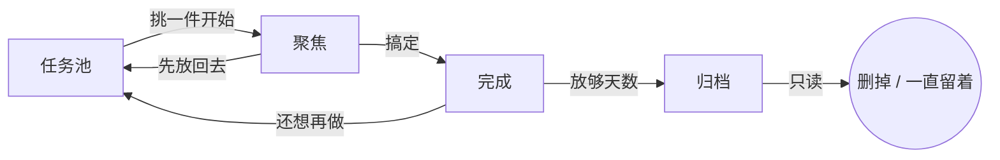

<p align="center">
  
</p>

<h1 align="center">随随办办 / FlowDo</h1>

<p align="center">
  不设截止日期。想到就丢进任务池，一次只盯手头这几件。<br>
  随随办办，总会办完。Go with the flow, get it done.
</p>

<p align="center">
  <a href="https://github.com/ShuangqiLi/FlowDo/releases"></a>
  <a href="LICENSE"></a>
  
  
</p>

客户端只有网页端，浏览器打开就能用，不用装 App。服务端和网页端都由你自己部署，
任务存在你自己的 PostgreSQL 里。没有官方托管，没有在线 Demo，发版包解压就能跑。

## 它是怎么运转的

任务只有四个位置，一件事从进来到消失就走这一条路：



| 位置 | 你在这里做什么 |
|---|---|
| **任务池** | 想到就写一行，或按住加号说一句。默认中优先级，先收下来再说 |
| **聚焦** | 从任务池挑几件真要动手的。有数量上限（默认 3 件），满了得先交差 |
| **完成** | 搞定的事。留几天回头能看见，然后自动进归档 |
| **归档** | 只读的旧账。可以手动删，也可以设成永久保留 |

没有截止日期，没有倒计时压力。整体借鉴了 GTD 的「先收集、再理清、只做手头这几件」，
但刻意做得更轻：不分情境标签，不建项目树，也不要求你每周坐下来做一次完整回顾。

## 一天里怎么用

**想到就收。** 任何界面点右下角（或你拖到的边缘）加号即可文字输入；长按住加号是语音输入
（用的是浏览器自带的语音识别，Chrome / Edge 可用，Firefox 会提示你直接打字）。
输入气泡跟着加号走。新任务一律中优先级，不在收集这一步逼你做判断。

**回头再理清。** 点开任务卡可以补几句随手记；点一下优先级徽章，就地弹出高 / 中 / 低的小菜单。

**只盯手头这几件。** 把任务从任务池放进聚焦。聚焦有上限，默认 3 件，满了想再加，
得先搞定一件或者放回去。底栏任务池 / 聚焦 / 完成三等分，聚焦坐正中间；空白处左右滑也能切页。
手机和电脑同一套手势（鼠标按住拖也行）：任务池右滑进聚焦、左滑删除（要再确认）；
聚焦右滑完成、左滑回任务池；完成左滑回任务池。设置在标题栏齿轮里；归档在设置里单独打开。

**每天看一眼。** 当天第一次打开会弹出「今日看看」：先列正在聚焦的，如果手头空着，
就从任务池挑几件高优先级的推荐给你。下面有月度回顾和日历，颜色深浅表示那天搞定多少。
看完划走，标题栏的太阳图标随时能再叫出来。

**完成之后自己收拾。** 完成的任务放够天数（默认 7 天）自动进归档；归档再放够天数
（默认 30 天）自动清掉。想留着就把清理天数填 `0`，归档里会显示「永久保留」，
定时任务不会碰它。

其他：账号登录的多用户隔离（JWT），闲云 / 远山 / 归途 / 微光四套主题跟着账号走，
界面组件整理成了可复用的 [FlowDo UI Kit](docs/UI_KIT.md)。

## 技术架构

| 部分 | 用了什么 |
|---|---|
| 客户端 | Flutter Web，产物由 nginx 容器托管，浏览器直接访问 |
| 服务端 | NestJS + Prisma + PostgreSQL，JWT 鉴权，按账号隔离数据 |
| 编排 | Docker Compose 同时启动 PostgreSQL、API 和 Web |
| 访问 | nginx 把 API 路径同源反代给服务端，默认端口 8080 |

网页端默认开在 `8080`，API 默认开在 `13000`，两者端口都能在 `.env` 里改；
数据库不映射到宿主机。浏览器只访问网页端，nginx 会把 `/auth`、`/tasks` 等路径
同源转给 API，不用配置地址或跨域。CanvasKit 和中文字体都打进镜像，内网环境一样能渲染。

本项目只面向可信内网，默认使用 HTTP。HTTP 登录时账号和密码会以明文经过网络，
不要把端口映射到公网，也不要在不可信网络上使用。

状态流转的硬规则：待办 ↔ 聚焦，聚焦 → 完成，完成 → 待办 / 归档；归档只读，
不能改状态，只能删除。

## 快速上手

从 [Releases](https://github.com/ShuangqiLi/FlowDo/releases) 下载 `FlowDo-vX.Y.Z.zip`，
解压到装了 Docker 的机器上。包里只有编排文件、服务端和网页端两个镜像、一键启动脚本和一份说明，
不需要 Node.js，也不需要 Flutter。

```bash
chmod +x start.sh && ./start.sh    # Windows 用 start.ps1
```

脚本会生成 `.env`、加载镜像、拉起容器，并等 API 和网页端都通过健康检查；没起来会报错退出。
网页不开放注册。账号写在部署目录的 `.user` 里，一行一个「用户名 密码」：

```
user password
alice 另一段密码
```

启动脚本按这个文件对齐数据库：没有的新建，密码改了就更新，从文件里去掉的账号会删除（任务一并删除）。
没有 `.user` 时不动数据库里已有的账号。然后手机或电脑浏览器打开 `http://<部署机 IP>:8080`，输入用户名和密码登录。
要改端口，编辑 `.env` 里的 `WEB_PORT` / `API_PORT` 后重跑脚本。升级、语音输入、停止与数据等细节见
[DEPLOY.md](DEPLOY.md)（发版包里的 `README.md` 就是它）。

### 从源码跑

想改代码或者不想用发版包（需要本机装 Flutter SDK）：

```bash
# 同一个脚本放在仓库根目录就会从源码构建网页端 + 服务端镜像，再启动 PostgreSQL + API + 网页端
./start.sh                   # Windows 用 start.ps1

# 只调客户端
cd app && flutter pub get && flutter run -d chrome
```

不用 Docker 直接跑服务端，以及网页端的构建细节，见 [CONTRIBUTING.md](CONTRIBUTING.md)。

<details>
<summary>API 摘要</summary>

| 方法 | 路径 | 说明 |
|---|---|---|
| POST | `/auth/login` `{username, password}` | 登录 |
| POST | `/auth/refresh` `{refreshToken}` | 刷新令牌 |
| GET/PATCH | `/me` | 当前用户；PATCH `{archiveAfterDays, focusLimit, deleteArchivedAfterDays, showArchiveTab, themeKey, voiceInputEnabled}` |
| GET | `/tasks?status=TODO` | 列表，按优先级 |
| POST | `/tasks` | 新建，默认待办 + 中优先级 |
| PATCH | `/tasks/:id` | 改标题 / 正文 / 优先级 / 状态；归档任务只读 |
| DELETE | `/tasks/:id` | 待办（不做了）或归档任务可删 |
| GET | `/briefing/today` | 今日看看 |
| POST | `/archive/run` | 立即执行归档与过期清理 |
| GET | `/system/about` | 当前版本，以及 GitHub 上有没有更新 |
| POST | `/system/update` | 下载新版本并换上网页和接口镜像 |

除 `/auth/*` 和 `/health` 外都需要 `Authorization: Bearer <accessToken>`。

进入完成时写入 `completedAt`，服务端每小时把超过 `archiveAfterDays` 的完成任务转为归档并写入
`archivedAt`；归档超过 `deleteArchivedAfterDays`（默认 30）自动删除，设为 `0` 则永不清理。
同时聚焦的数量受 `focusLimit`（默认 3）限制。

</details>

## 参与

欢迎提 issue 和 pull request。提交信息用约定式提交，发版走 `vX.Y.Z` 标签，
GitHub Actions 会构建上面那些产物并创建 Release。细节见
[CONTRIBUTING.md](CONTRIBUTING.md) 和 [CHANGELOG.md](CHANGELOG.md)。

## 许可证

[MIT](LICENSE)
