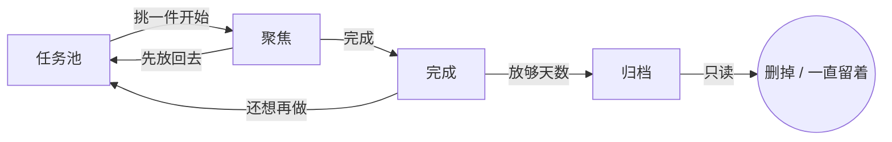

<p align="center">
  
</p>

<h1 align="center">随随办办 / FlowDo</h1>

<p align="center">
  不设截止日期。想到就丢进任务池，一次只盯手头这几件。<br>
  随随办办，总会办完。Go with the flow, get it done.
</p>

<p align="center">
  <a href="https://github.com/ShuangqiLi/FlowDo/releases"></a>
  <a href="LICENSE"></a>
  
  
</p>

客户端只有网页端，浏览器打开就能用，不用装 App。服务端和网页端都由你自己部署，
任务存在你自己的 PostgreSQL 里。没有官方托管，没有在线 Demo，发版包解压就能跑。

## 它是怎么运转的

任务只有四个位置，一件事从进来到消失就走这一条路：


```mermaid
flowchart LR
    A[任务池] -->|挑一件开始| B[聚焦]
    B -->|完成| C[完成]
    B -->|先放回去| A
    C -->|放够天数| D[归档]
    C -->|还想再做| A
    D -->|只读| E((删掉 / 一直留着))
```

| 位置 | 你在这里做什么 |
|---|---|
| **任务池** | 想到就写一行，或按住加号说一句。默认无优先级，先收下来再说 |
| **聚焦** | 从任务池挑几件真要动手的。有数量上限（默认 3 件），满了得先交差 |
| **完成** | 完成的事。留几天回头能看见，然后自动进归档 |
| **归档** | 只读的旧账。可以手动删，也可以设成永久保留 |

没有截止日期，没有倒计时压力。整体借鉴了 GTD 的「先收集、再理清、只做手头这几件」，
但刻意做得更轻：不分情境标签，不建项目树，也不要求你每周坐下来做一次完整回顾。

## 一天里怎么用

**想到就收。** 任何界面点右下角（或你拖到的边缘）加号即可文字输入；长按住加号是语音输入
（用的是浏览器自带的语音识别，Chrome / Edge 可用，Firefox 会提示你直接打字）。
输入气泡跟着加号走。新任务一律无优先级，不在收集这一步逼你做判断。

**回头再理清。** 点开任务卡可以补几句随手记；点一下优先级徽章，就地弹出高 / 中 / 低 / 无，以及「提醒」。
提醒要选一个比现在晚的分钟：日历从周一起、中文界面，时分可以用加减，也可以点数字用键盘输入（小时 0–23、分钟 0–59）。
循环可以是每天、每周、每月、每年，或写一段五段 crontab（`分 时 日 月 周`，例如工作日早上九点 `0 9 * * 1-5`）。
每月、每年和仅一次还可以按农历走。到点后任务自动进入聚焦，并出现在右上角通知里；循环提醒会复制一份进聚焦，原来的那条继续排下一次。
提醒任务不能从任务池滑进聚焦。进了聚焦会排在最上面，还在任务池里则排在最底下。完成后直接删掉，不进完成列表。
设置里可以关掉「在任务池显示循环提醒」，关掉后循环仍会到点，只是不列在任务池。

**只盯手头这几件。** 把任务从任务池放进聚焦。聚焦有上限，默认 3 件，满了想再加，
得先完成一件或者放回去。底栏是悬浮的胶囊条：任务池 / 聚焦 / 完成，以及可选的归档和设置；
五个入口等宽排布，空白处左右滑也能切页（滑到底会绕回另一头）。手机和电脑同一套手势
（鼠标按住拖也行）：任务池右滑进聚焦（提醒任务到点才自动进去，不能手滑）、左滑删除（要再确认）；聚焦右滑完成、左滑回任务池；
完成左滑回任务池。随手记输入框里选字或横滑不会退出详情，空白处右滑才关掉。
新建的任务会自动滚到眼前。

**不同的事分开放。** 左上角是任务空间，工作、家里、某个项目各开一个，点一下切换，也能在那里新建和改名。
任务池 / 聚焦 / 完成 / 归档都跟着当前空间走。主题、聚焦上限和归档习惯也按空间各自记一份；
详情页可以把任务挪到另一个空间，状态不变。

**每天看一眼。** 当天第一次打开会弹出「今日看看」：有聚焦任务就列出它们（提醒排在最前），手头空着时再从当前空间的任务池里挑几件高优先级推荐给你。
下面的月度回顾和日历也只看当前空间。格子分两行写日期：上面公历，下面稍小的农历。
过去的日子只看完成（3 个点合成星、3 个星合成皇冠）；今天既看还没到点的提醒（小旗在上）也看完成（点 / 星 / 皇冠在下）；往后的日子只看提醒（小旗最多三面再加 +）。左右滑能换月份。
看完划走，标题栏的太阳图标随时能再叫出来。

**完成之后自己收拾。** 完成的任务放够天数（默认 7 天）自动进归档；归档再放够天数
（默认 30 天）自动清掉。想留着就把清理天数填 `0`，归档里会显示「永久保留」，
定时任务不会碰它。这些天数按当前任务空间各自生效。

其他：一台部署只有一个登录密码（JWT），在设置里改，数据库里只存哈希。
闲云 / 远山 / 归途 / 微光 / 柳烟 / 夜泊 / 雾梅七套主题跟着当前任务空间走，界面组件整理成了可复用的 [FlowDo UI Kit](docs/UI_KIT.md)。

## 技术架构

| 部分 | 用了什么 |
|---|---|
| 客户端 | Flutter Web，产物由 nginx 容器托管，浏览器直接访问 |
| 服务端 | NestJS + Prisma + PostgreSQL，JWT 鉴权，单实例，任务按任务空间隔离 |
| 编排 | Docker Compose 同时启动 PostgreSQL、API 和 Web |
| 访问 | nginx 把 API 路径同源反代给服务端，默认端口 8080 |

网页端默认开在 `8080`，API 默认开在 `13000`，两者端口都能在 `.env` 里改；
数据库不映射到宿主机。浏览器只访问网页端，nginx 会把 `/auth`、`/tasks` 等路径
同源转给 API，不用配置地址或跨域。CanvasKit 和中文字体都打进镜像，内网环境一样能渲染。

本项目只面向可信内网，默认使用 HTTP。HTTP 登录时密码会以明文经过网络，
不要把端口映射到公网，也不要在不可信网络上使用。

状态流转的硬规则：待办 ↔ 聚焦，聚焦 → 完成，完成 → 待办 / 归档；归档只读，
不能改状态，只能删除。提醒任务不能从待办改成聚焦，到点由服务端送进去。

## 快速上手

从 [Releases](https://github.com/ShuangqiLi/FlowDo/releases) 下载 `FlowDo-vX.Y.Z.zip`，
解压到装了 Docker 的机器上。包里只有编排文件、服务端和网页端两个镜像、一键启动脚本和一份说明，
不需要 Node.js，也不需要 Flutter。

```bash
chmod +x start.sh && ./start.sh    # Windows 用 start.ps1
```

脚本会生成 `.env`、加载镜像、拉起容器，并等 API 和网页端都通过健康检查；没起来会报错退出。
手机或电脑浏览器打开 `http://<部署机 IP>:8080`。网页不开放注册。第一次打开会让你设一个密码，再输一次确认，设好就进去。
密码只以哈希存在数据库里，之后在设置里改。
要改端口，编辑 `.env` 里的 `WEB_PORT` / `API_PORT` 后重跑脚本。升级、语音输入、停止与数据等细节见
[DEPLOY.md](DEPLOY.md)（发版包里的 `README.md` 就是它）。

### 从源码跑

想改代码或者不想用发版包（需要本机装 Flutter SDK）：

```bash
# 同一个脚本放在仓库根目录就会从源码构建网页端 + 服务端镜像，再启动 PostgreSQL + API + 网页端
./start.sh                   # Windows 用 start.ps1

# 只调客户端
cd app && flutter pub get && flutter run -d chrome
```

不用 Docker 直接跑服务端，以及网页端的构建细节，见 [CONTRIBUTING.md](CONTRIBUTING.md)。

<details>
<summary>API 摘要</summary>

| 方法 | 路径 | 说明 |
|---|---|---|
| POST | `/auth/status` | 是否还没设密码 |
| POST | `/auth/setup` `{password}` | 第一次设密码，设过之后不能再调 |
| POST | `/auth/login` `{password}` | 登录 |
| POST | `/auth/refresh` `{refreshToken}` | 刷新令牌 |
| POST | `/auth/change-password` `{currentPassword, newPassword}` | 修改密码 |
| GET/PATCH | `/me` | 当前空间设置；PATCH 含 `activeSpaceId`、归档天数、聚焦上限、主题、语音、是否显示归档 |
| GET/POST | `/spaces` | 任务空间；PATCH/DELETE `/spaces/:id` |
| GET | `/tasks?status=TODO` | 列表；聚焦里提醒在最前，任务池里提醒在最后 |
| POST | `/tasks` | 新建，默认待办 + 无优先级 |
| PATCH | `/tasks/:id` | 改标题 / 正文 / 优先级 / 提醒时间与循环 / 状态 / 所属空间；归档任务只读 |
| DELETE | `/tasks/:id` | 待办（不做了）或归档任务可删 |
| GET | `/notices` | 当前空间的提醒通知 |
| POST | `/notices/read` | 标为已读 |
| DELETE | `/notices` | 清空当前空间的通知 |
| GET | `/briefing/today?tzOffset=` | 今日看看（当前空间） |
| GET | `/briefing/month?year=&month=&tzOffset=` | 某月回顾（当前空间；过去看完成，今天提醒在上、完成在下，往后看提醒） |
| POST | `/archive/run` | 立即执行归档与过期清理 |
| GET | `/system/about` | 当前版本，以及 GitHub 上有没有更新 |
| POST | `/system/update` | 下载新版本并换上网页和接口镜像 |

除 `/auth/login`、`/auth/refresh`、`/auth/status`、`/auth/setup` 和 `/health` 外都需要 `Authorization: Bearer <accessToken>`。
`/tasks` 和 `/briefing/*` 只返回当前任务空间（`/me` 的 `activeSpaceId`）的数据。`tzOffset` 是客户端时区相对 UTC 的分钟数，缺省按中国（+480）。

提醒任务的 `priority` 为 `REMINDER`，`remindAt` 必须晚于现在；`remindRepeat` 可以是 `ONCE` / `DAILY` / `WEEKLY` / `MONTHLY` / `YEARLY` / `CRON`。`CRON` 时要带五段 `remindCron`（分 时 日 月 周）。`remindLunar` 为真时，每月/每年按农历走。

进入完成时写入 `completedAt`，服务端每小时把超过 `archiveAfterDays` 的完成任务转为归档并写入
`archivedAt`；归档超过 `deleteArchivedAfterDays`（默认 30）自动删除，设为 `0` 则永不清理。
同时聚焦的数量受 `focusLimit`（默认 3）限制。

</details>

## 参与

欢迎提 issue 和 pull request。提交信息用约定式提交，发版走 `vX.Y.Z` 标签，
GitHub Actions 会构建上面那些产物并创建 Release。细节见
[CONTRIBUTING.md](CONTRIBUTING.md) 和 [CHANGELOG.md](CHANGELOG.md)。

## 许可证

[MIT](LICENSE)
